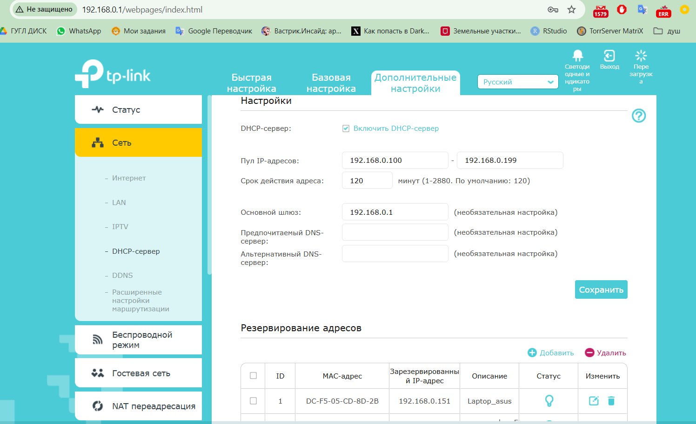
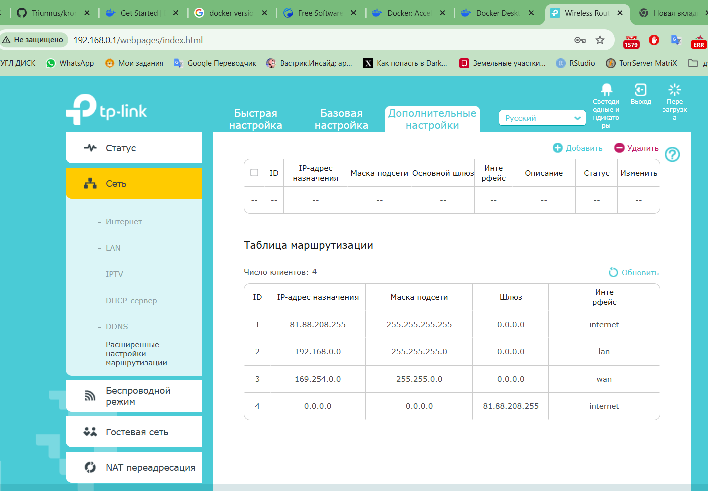
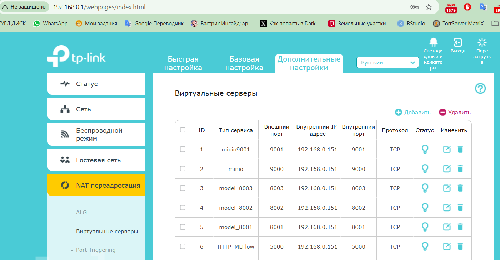
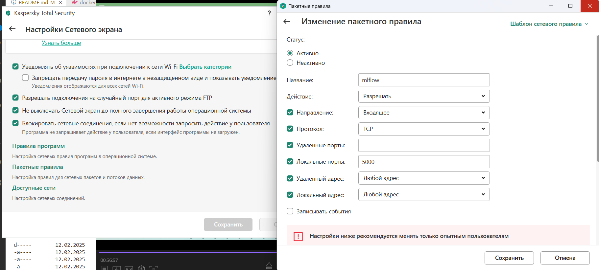
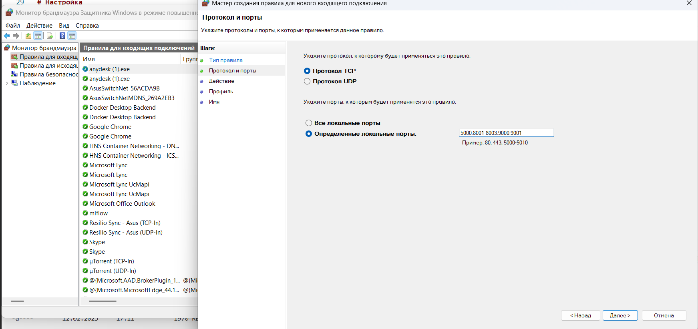
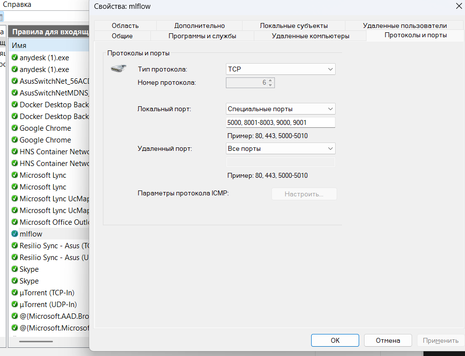

# Mlflow-server-on-windows
## _ONE CLICK_
 
Данная репоризиторий позволт устаноовить и запустить сервер MLflow на windows в один клик.
Так же доступ MLFlow и Deploy к интеренете через внешний (Статический IP)

# Быстрый старт
0. Купить Внешний (статистический) IP. (Опцианально)
1. Присваеваем ПК ip-adress **192.168.0.151**
2. Устанавливаем Docker (https://www.docker.com/). (Current version: 4.36.0 (175267))
3. Запускаем **start-mlflow.bat** (Ждем когда установит и скачает все программы)
4. После выполнения и установок закрываем и еще раз запускаем **start-mlflow.bat**, где он уже запустит сервера

# Запуск и остановка серверов
_Стартуем серваки через_ **start-mlflow.bat**  
_Останавливаем серваки через_ **stop-mlflow.bat**

# URL
- Jupiter - http://localhost:8888/  
Все сохраяемые файлы и зименения хранятся в папке `work`
- MLflow - http://192.168.0.151:5000/  
- MINIO - http://localhost:9001/

Внешний адрес можно узнать на 2ip.ru  
@ Пример: 81.88.208.255  
- MLflow - http://81.88.208.255:5000/  
- MINIO - http://81.88.208.255:9001/  

# Логины и пароли (по умолчанию)
## Minio и MYSQL 
Файл `.env` -  устанавливаем свои логин и пароль.  
По умолчанию 
```
AWS_ACCESS_KEY_ID=minio
AWS_SECRET_ACCESS_KEY=minio123
MYSQL_DATABASE=mlflow_database
MYSQL_USER=mlflow_user
MYSQL_PASSWORD=mlflow
MYSQL_ROOT_PASSWORD=mysql
```
## Mlflow и модели
`Caddyfile`
```
# mlflow
admin looChaekie9Eitow

# jupyter
8001 admin Aiquoos5ahNgai8o
8002 admin aZee2eeshuth7qua
8003 admin Nai8shohj2ki6Cei
```

# Настройка для доступа из Интернета
## Настройка IP роутера
В роуетре за ноутом/компом закрпить ip (192.168.0.151)  
Настроить переадресацию внешнего IP на ваш.  
Заменить 81.88.208.255 на ваш.  
Пример в роутере TP-Link.

 

## Настройка Антивируса/Защиты
- Добавить исключени в антивируса.  
Добавляем MLFlow и порт для каждой модели.  

  
- Брэдмаур  
  `Брандмауэр защитника Windows` -> `Дополнительные парметры` -> `Правило для входящих подключений` -> `Создать правило` -> `Для порта` -> `Далее` -> `Протокол TCP` -> `Определенные локальные порты` -> Вписываем `5000,8001-8003,9000,9001` -> `Далее` -> `Далее` -> `Далее` -> Вписываем имя `mlflow` - `Готово`



- Добавление дополнительных портов (модели/streamlit/другое)


# Добавление дополнительной моделей или других приложений (Python)
В `docker-compose.yml` в строке **11**  
Добавляем нужные порты
```
    caddy:
        image: caddy:latest
        container_name: caddy-container
        volumes:
            - ./Caddyfile:/etc/caddy/Caddyfile
        restart: unless-stopped
        ports:
            - "5000:5000"
            - "8001:8001"
            - "8002:8002"
            - "8003:8003"
            - "2019:2019"
            - "8004:8004" #Добавили нужный порт
```
В строке **93**  
Добавляем нужные порты
```
    jupyter:
        build:
          context: .
          dockerfile: ./docker/jupyter/Dockerfile
        container_name: jupyter
        volumes:
          - ./jovyan:/home/jovyan
          - ./credentials:/home/jovyan/.aws/credentials
        ports:
          - 8888:8888
        expose:
          - "8001"
          - "8002"
          - "8003"
          - "8004" #Добавили нужный порт
        command: "start-notebook.sh --NotebookApp.token="
```
В файл `Caddyfile`  
В конце добавляем   
```
http://192.168.0.151:8004 {
	reverse_proxy jupyter:8004
}


# Доступ из сети без авторизации
http://81.88.210.241:8004 {
	reverse_proxy jupyter:8004
}

# ИЛИ

# # Доступ из сети С авторизаций.
# Добавляет авторизацию
# Пароль можно зашифровать в контейнере "caddy-container"
# Команда : caddy hash-password a12345a
http://81.88.210.241:8004 {
	basic_auth {
		admin $2a$14$QN7CZ4aQ7Hpy9EKTImI/eetKvZPk6T.pP/31EvQmKJ8/E/IoTfFbS
	}
	reverse_proxy jupyter:8004
}
```

Так же этот порт в **Антивирус** и **Брэндмаур**


